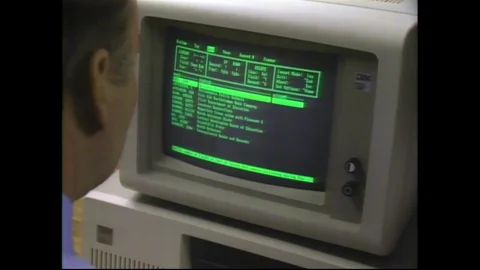
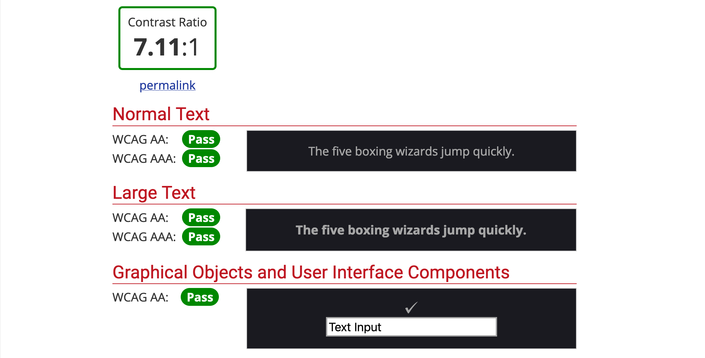

_This site now has dark mode_ ☀️ 🌑  
_Try it out from the toggle at the top right of the navigation._

In the next few posts I'm detailing the process of incorporating dark mode into my website.

Part I covers **design considerations and implications of creating a dark mode UI**.

 
 
 

<caption>
  Dark mode for macOS allows users to auto-switch UI appearance depending on
  time of day
</caption>

### The Dark Side

With the release of macOS Mojave in 2018, Apple introduced a system-wide dark mode setting — I still remember the old days of Snow Leopard where we'd go to the lengths of installing [third-party plugins](https://github.com/w0lfschild/DoctorDark) to get this specific look. It was all the rage amongst my friends and I.

Having this sleek, **dark UI**, was cool. It turned heads and made others go _"Wow, how did you do that?"_, but perhaps most importantly, it made us feel unique - like we had something that no one else we knew had.

<caption>Monochrome logos are used by many top brands</caption>

#### Mystery. Elegance. Intrigue.

[Traditionally](https://www.bourncreative.com/meaning-of-the-color-black/), black colours are used to evoke these emotions in us. It's the reason why many luxury and high-end brands use monochrome, serif lettering for their brand. It makes us feel like the product is of higher quality than your standard run-of-the-mill, that maybe we _should_ justify the higher cost.

Nowadays, dark mode is more or less ubiquitous — driven by the big players in the industry like Apple, Google, Facebook and Twitter, who all boast dark mode versions of their products. Quite simply, if you're designing products for screens, dark mode _should_ be an important consideration, if not a primary one.

> Dark Mode makes it easier to stay focused on your work, because your content stands out while darkened controls and windows recede into the background. [[source]](https://support.apple.com/en-us/HT208976)

<caption>Follow the white rabbit.</caption>

### Dark mode is just better - right?

According to [this study](https://medium.com/dev-channel/let-there-be-darkness-maybe-9facd9c3023d), some 80% of users surveyed responded that they voluntarily use dark mode.

Of which, the most common answer _for_ was - "It's easier on the eyes" - and _against_ - "It doesn't look right".

Now, these figures are from a fairly small sample size and are quite possibly skewed, but it does give us a good insight into user behaviours. The jury is still out on whether [science backs up the claim](https://www.wired.co.uk/article/dark-mode-chrome-android-ios-science) that dark mode is "good for your eyes" — what we can gleam is that dark mode is a design feature that a subset of users specifically look for. What we also know from the top answers is that, when done right, it provides a tangible improvement to the user, even if only _perceived_.

When done wrong or not properly accounted for in the design, it inevitably falls short, hindering user experience.

<caption>An old CRT monitor</caption>

#### Why is it hit-or-miss?

Back in the early days of computing, old school cathode-ray tube screens didn't possess the technology to light up the entire screen, only the essential information, giving us this _Matrix_ style aesthetic that had its resurgence in the 90s.

When we look at RGB colour space and more specifically, the now common vast array of LED, OLED, AMOLED, P-OLED and other such screen technologies, we can start to understand where this affinity for dark mode is born from.

<caption>

Anatomy of an OLED panel — [[Source]](https://tech-society.com/what-is-the-difference-between-lcd-oled-and-amoled-screens-and-what-is-the-best/)

</caption>

RGB is **additive** colour space, as opposed to CMYK (used in printing), which is **subtractive** colour space. What this means is that the 'default state' of a screen (ie. when nothing is shown) is black. Adding all available colours will give you white. 

Printing gives you the opposite effect, wherein adding all the colours will get you to black.

<caption>

Additive and subtractive colour — [[Source]](https://www.tvtechnology.com/opinions/additive-and-subtractive-color-mixing)
  
</caption>

In modern OLED panels, the screen doesn't have a backlight — this means that blacks are truly black, giving a rich, higher contrast appearance. It's why many dark mode advocates claim it improves battery life; but because of the costly manufacturing process of this type of screen, they're more commonly used in small form factors, such as our smartphones, where we can better appreciate the full colour spectrum.

#### So what are the design implications of this?

Although the majority of desktop monitors and laptops are LCD panels, many high-end smartphones do have LED panels. This means that websites and apps, in particular, should account for dark themes since they're now both supported by default on iOS and Android systems.

Additive colour means that the more 'white' in our screens, the brighter the individual pixel on our screens. This, seemingly, adds to the strain to our eyes from consistent screen usage. Dark mode, on the other hand, is illuminating the content we read and allowing it to stand out whilst _"darkened controls and windows recede into the background"_.

When we observe one of the oldest forms of media: books, and their modern iteration: ebook readers for that matter, we can start to see some correlation between the them and contemporary dark mode.

Ebook readers typically use an [E-Ink display](https://www.visionect.com/blog/electronic-paper-explained-what-is-it-and-how-does-it-work/). This seeks to replicate, as much as possible, the experience of reading printed words on paper.

Technology aside, the result of this process is that the text 'jumps out' from the contrasting background. Of note is that the contrast between text and background is not too high, giving space for our eyes to focus and adjust without straining too much. Alternatively, some users report added eye strain when using dark mode during the day, which may be caused by not enough light contrast due to their bright surroundings or poor colour optimisation.

<caption>

Iris and pupil in different lighting conditions — [[Source]](https://www.teachoo.com/10493/3033/What-is-the-function-of-Iris-and-Pupil-/category/Concepts/)

</caption>

### Designing for dark UI
Hopefully the background outlined above gives you some insight on how you should approach designing for a dark theme. Done correctly and the shift between light and dark should be seamless. Here's some further design tips to consider:

#### 1. Find a good balance between _dark_ and _not too dark_.
Quite often, dark theme doesn't call for the use of pure black () — a better option is to use a grey hue. Consider your brand colours and add a subtle coloured grey to use as your background colour for more personality.

<caption>

Using a grey hue will ease contrast and make for easier reading

</caption>

#### 2. Test your designs and check contrast levels
Make sure you're not straining your users' eyes with high contrast levels and saturated colours. Normally, the effects of bright colours are dulled due to bright surroundings or negative space in a layout — a dark background means colours appear significantly bolder.

[Apple's Human Interface Guidelines](https://developer.apple.com/design/human-interface-guidelines/ios/visual-design/dark-mode) suggest a colour contrast ratio of 7:1.

<caption>

Use [WebAIM Contrast Checker](https://webaim.org/resources/contrastchecker/) to test your designs

</caption>

#### 3. Adapt text to dark backgrounds
You can optionally reduce font weight of your text and increase the letter tracking. This allows the text to "breathe" a little more, reducing the effect of the design feeling cluttered due to large blocks of text on a dark layout. 

<caption>

Bolder vs lighter font weight

</caption>

#### 4. Adjust shadows and consider elevation

Whereas a default theme uses shadows to express hierarchy and elevation within a layout, shadows are much less pronounced in a dark theme — adjustment of both the shadow and surface colour is required.

<video autoPlay loop muted style={{width: "100%", height: "auto"}}>
  <source src="dark-elevation.mp4" type="video/mp4" />
</video>

<caption>

[Google's Material Design Reference](https://material.io/design/color/dark-theme.html#properties) has a great breakdown on this topic

</caption>

#### 5. Optimise your assets for colour adjustment

Lower the brightness of images to reduce colour saturation against dark backgrounds. I'm using the following CSS snippet to reduce brightness of images without losing too much integrity.

`  
img {
  filter: brightness(0.8) contrast(1.2);
}
`

Likewise, accent colours should also be reduced in saturation to aid with legibility and contrast. 

In my case:
 #a45efd => 
&nbsp; #b38ce6

 
 

<caption>

Original vs adjusted image

</caption>
