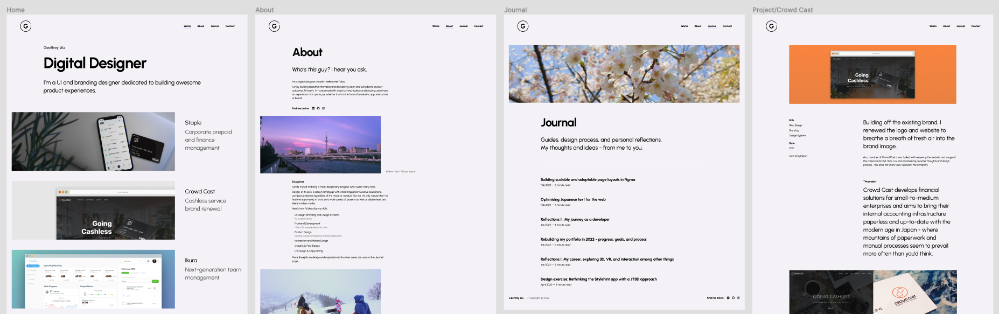
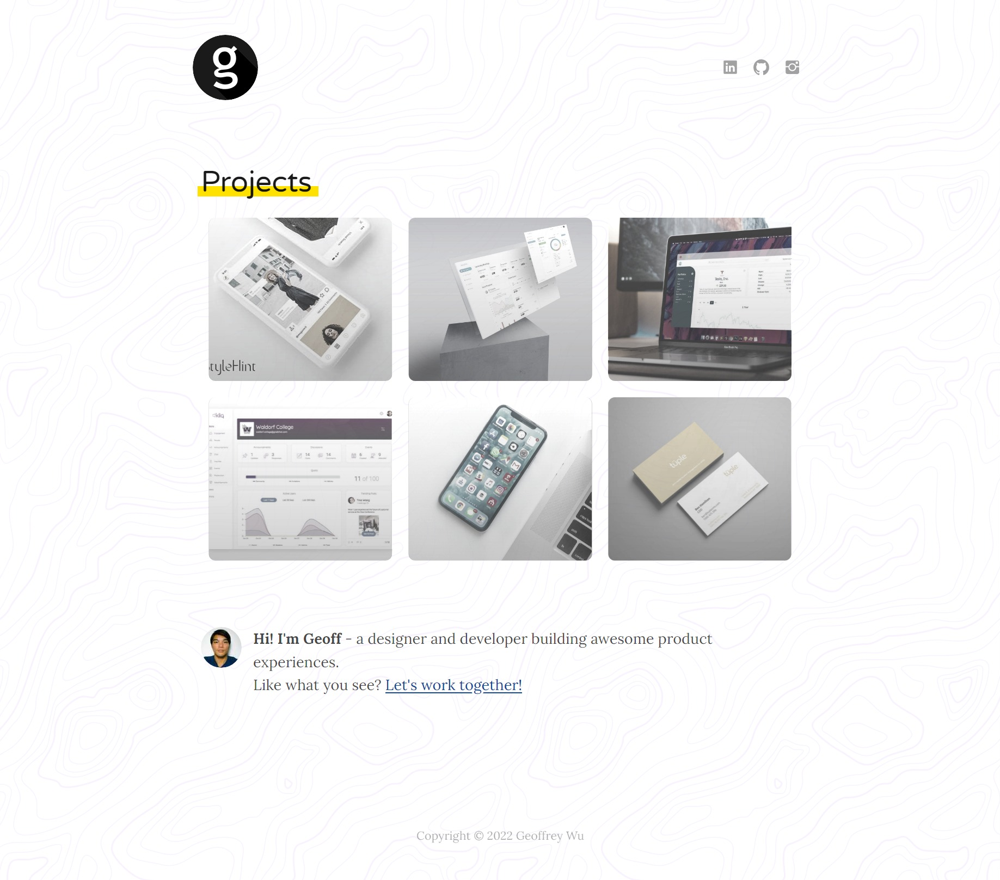
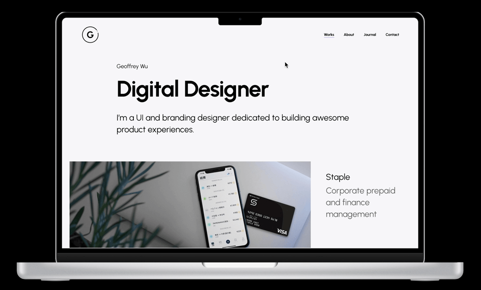
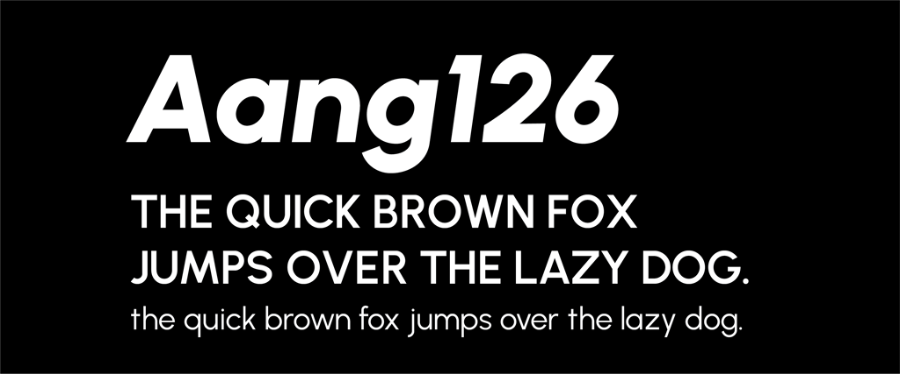
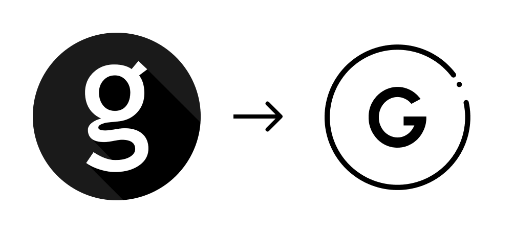
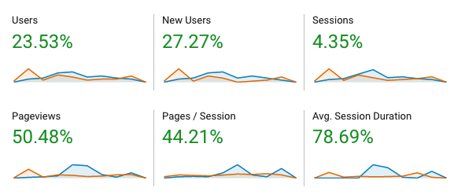

<caption>

_This new site, laid out in Figma_

</caption>

At the turn of the year, I decided to redesign my portfolio site.

Having not undertaken a major update in a few years, I thought it was important to complete analysis of the current user flow and visual appearance to better suit current trends and to better reflect my current skills and capabilities.

### Case study

In analysing my website, I sought to assess whether or not it effectively communicated to the target audience of design thinkers and product-focused professionals, whether that's a potential client or prospective employer.

I also defined the primary objective of the site: **to visually communicate my own thoughts, ideas, and work processes**.

<caption>

_What this site used to look like_

</caption>

Previously, this site had limited navigation, being a single index page linking to individual portfolio posts. I used a [Gatsby](https://www.gatsbyjs.com/) blog template build to generate the site framework and made minor customisations until it resembled something akin to my liking.

Admittedly I lacked the knowledge a few years ago, both in best design practices and building a site using React, to sufficiently create the kind of site I really wanted.

 

**The problems**

In short, I found these to be the main 'blockers' to my site acheiving the aforementioned objective:

- The site showcases my works but, other than breaking down each work item, doesn't do much to reflect myself. **How can I redesign the site to reflect more contemporary trends?**
- The design leaves a lot to be desired; it's simplified but could better utilise the given area, especially in the desktop layout. **How can I create a more visually engaging layout?**
- Visitors to the site do not have an easily accessible outlet to find out more about me. **How can I better resonate with the target audience and express my ideas and views on design?**

**Actionable solutions**

After some reflection and research into others' portfolio sites, (some of my favourites are [here](https://chenhuijing.com/), [here](https://heckhouse.com/), and [here](https://www.tparkes.com/)) I came up with the following actionable items to develop a better personal showcase.

- **Go back to the drawing board** - redesign the site and my personal visual identity from scratch.
- **Research current design trends** - gather inspiration and learn from others.
- **Write and share** - use the current site framework to develop a blog and drive user traffic.

### Process

<caption>

_The original prototype as mocked in Figma_

</caption>

**Setting the stage**

Starting with the design language, I retained the same purple colour from my previous site here to use as the primary accent colour (). I like the cool, elegant aura of this purple. 

I kept remaining elements largely monochrome so as to draw the focus on content and imagery.

Next, I defined a font to use globally across the site. The font chosen was [Urbanist](https://github.com/coreyhu/Urbanist), a low-contrast, geometric sans-serif type that plays well with web contexts owing to its high legibility. Modern, sleek, and adaptable with variable weights - I felt it was the best solution to refreshing my site appearance, which previously had a 'blog-style' sans-serif type throughout.

Next came the logo, which has seen many iterations in the past.

This time, I decided to keep it plain and simple by playing off the geometric shape of the typeface.

<caption>

_Old to New_

</caption>

**Defining the structure**

What I decided from the planning stage was to feature my personality more, so I knew I wanted to add two additional sections: About and Journal. An 'About' page is self-explanatory enough but for the Journal section, I decided to share more of my thoughts about design process, as well as share guides or document things that don't necessarily fit into a Portfolio post.

When it came to actually developing the site, I found that my codebase was quite poorly maintained with a lot of unused plugins, bad practices, and inconsistent style choices. It was clear that I had a poor understanding before of how all the parts came together and now with two dynamically generated sections: 'Works' and 'Journal', something had to be done.

I won't go into detail about everything here (and if you're interested, the [code is here](https://github.com/gwu205/folio)) but these are the main resources I used to clean up the site:

- [Gatsby docs](https://www.gatsbyjs.com/docs/) - This was hugely helpful in updating my site from v2 to v4 and making sure that all the packages I was including were necessary. Namely, I read up a lot on proper usage of [CSS Modules](https://www.gatsbyjs.com/docs/tutorial/part-2/#css-modules), [MDX](https://www.gatsbyjs.com/docs/mdx/writing-pages/) for more flexible page generation, and [GraphQL](https://www.gatsbyjs.com/docs/tutorial/part-4/), which has always been a bit murky for me.

- YouTube - I regularly follow creators just to keep up-to-date with the industry and discover new ways to design. My go-tos are [Mizko](https://www.youtube.com/c/Mizko/videos), [The Futur](https://www.youtube.com/c/thefuturishere/videos), and [Figma](https://www.youtube.com/c/Figmadesign/videos).

- Some good ol' CSS (I recommend [this](https://adamschwartz.co/magic-of-css/) for understanding some core concepts) - I decided against using any particular framework this time to keep things light and easily maintainable.

 

All in all, the complete redesign took me a few weeks to finish from conception to release. I'm a stark believer in learning how to read, write, and understand code as a designer as I think this gives you much greater creative freedom and also gives you a better perspective on how to approach **designing for interfaces that not only work, but delight**.

### Post-release

So how did I do? Only time will tell...

Hopefully reading about this process has left a positive impact on you. Personally, I'm satisfied with how the site turned out and I learned a lot through developing it all on my own. There's still room for improvement but the beauty of having complete technical and creative control is that this site can grow with me.

What I can share it that, the site is registering well in terms of metrics when compared to this time last year (Jan 2021/Feb 2021 in orange vs. Jan 2022/Feb 2022 in blue).

I've got a list of items on a variety of subjects that I aim to write articles about this year and I'm excited to see what's to come.
