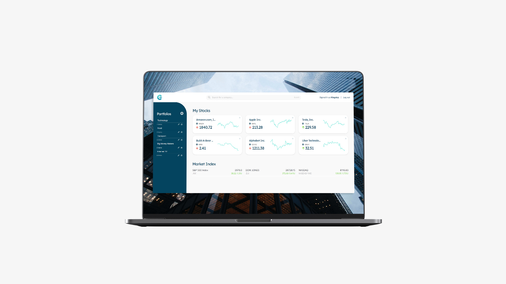
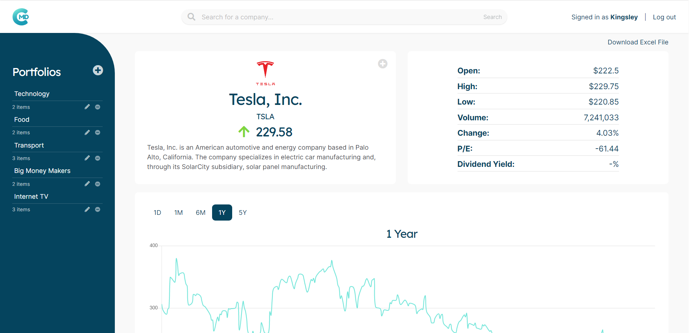
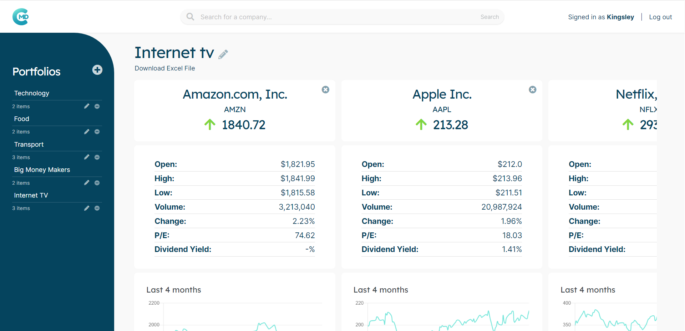

CompanyMD is a financial management solution designed for business analysts to keep track of company performance and stock market movements.
> ###Let financial data lead the way

Built as part of a rapid prototyping exercise to create an app using Ruby on Rails, I worked with a team of developers to create CompanyMD; I was in charge of designing and implementing the app’s front-end.

The app provides a solution to the problem of tedious and time-consuming data analysis and aggregation faced by financial professionals. With CompanyMD, users create a personalised portfolio of stocks to follow, with important data such as historical stock price graphs updated real-time, recent news, and 10K reports from the SEC. With a clean and clear user interface, stock performance can be tracked easily at a glance and if needed, users can perform deeper data analysis by clicking into company pages. Side-by-side comparison is also made easy through named portfolio groups, which displays companies together and enables the user to track specific interests and sectors.

In addition to providing initial wireframes, mockups, and colour palette, I also designed a logo to consolidate the brand identity.

###Watch our app demo!
<iframe width="560" height="315" src="https://www.youtube.com/embed/H3Hn1oa019Q?start=1022" frameborder="0" allow="accelerometer; autoplay; encrypted-media; gyroscope; picture-in-picture" allowfullscreen></iframe>
