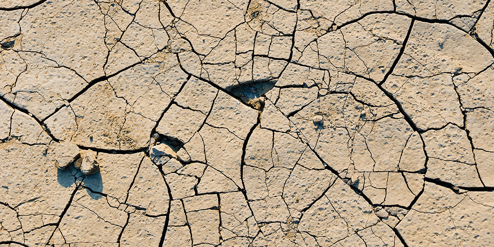
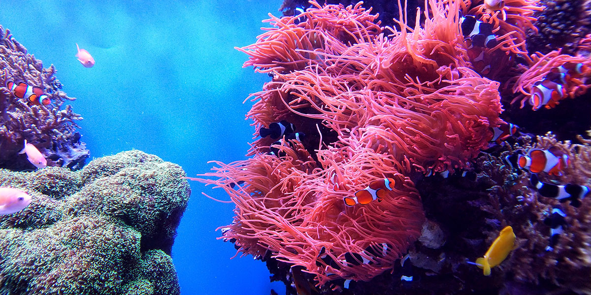
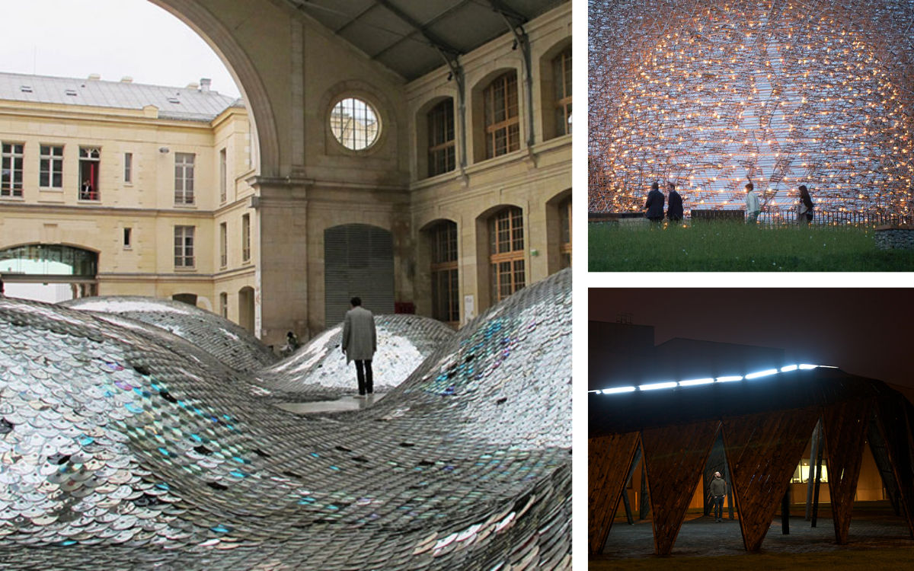
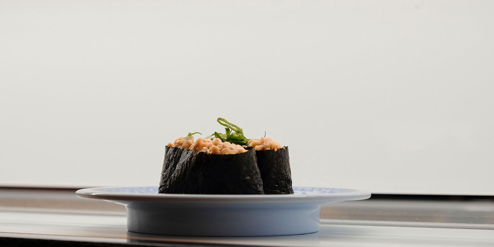
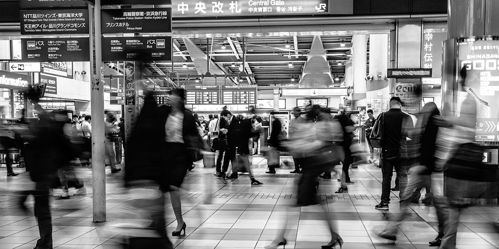

###### *The following is a design exploration for a public campaign that visually draws attention to an issue related to global warming*

### Global Warming

The Intergovernmental Panel on Climate Change, which includes more than 1,300 scientists from around the world, estimates that the global temperature will <a href="https://climate.nasa.gov/effects/" target="_blank">rise 2.5 degrees Celsius over the next century</a>.

The effects of global warming can already be felt today and its impact will continue to become more prevalent as years past if the global community does not come together to curb carbon emissions. In recent times, the Northeast Asia heatwave of 2018 <a href="https://www.japantimes.co.jp/news/2018/08/07/national/science-health/record-70000-people-rushed-hospitals-since-april-30-amid-scorching-japan-heat-wave/" target="_blank">hospitalised some 70,000 people</a> in Japan and the wildfires of Australia in 2019 ravaged the country for months; the country is still in recovery and may never fully recover from the effects as <a href="https://www.sydney.edu.au/news-opinion/news/2020/01/08/australian-bushfires-more-than-one-billion-animals-impacted.html" target="_blank">more than one billion animals</a> are estimated to have been killed in the fires.

In addition to these events, the following such effects can also be seen around the world:
- Melting of polar ice caps and rising sea waters, putting island nations under immediate risk of being completely submerged underwater.
- Increased frequency and severity of extreme weather events such as wildfires, flooding, drought, heatwaves, and typhoons.
- Disruption to biodiversity and natural ecosystems, leading to mass extintions and displacement of habitats.
- Increased air pollution leading to respiratory difficulties
- Hotter summers (<a href="https://public.wmo.int/en/media/press-release/2019-concludes-decade-of-exceptional-global-heat-and-high-impact-weather" target="_blank">WMO findings</a> report that the last decade had the most record breaking days of extreme heat ever)

### The problem

Can design be used as a tool to effect change in the world? To encourage people to adopt more eco-friendly lifestyles and more importantly, convince big corporations and governments that not only are renewable energy resources effective and profitable but also the way of the future?

A <a href="https://sustainabledevelopment.un.org/partnership/?p=2231" target="_blank">workshop held by the UN</a> in Asia found that the reluctance to adopt clean energy sources can be attributed to "general lack of awareness of the importance, benefits, and potential of renewable energy both among the general public and major stakeholders, thus constraining rapid adoption". As a result, government policy and legislation to promote renewable energy sources is insufficient and also leads to underdeveloped renewable energy industries.

Can design be used to educate the public about the merits of a cleaner way of life and to inform about the urgency of necessary climate action?

### Proposal

For this exploration, I decided to focus on the threat to our natural ecosystems, particularly the threat to our oceans and wildlife. Immediately, I thought about how this can be observed in my home country of Australia; the ecosystem of the Great Barrier Reef, a UNESCO World Heritage Site, is at risk of being completely destroyed within the next five years. <a href="https://www.theguardian.com/environment/2020/mar/25/great-barrier-reef-suffers-third-mass-coral-bleaching-event-in-five-years" target="_blank">Mass coral bleaching events</a> occur when ocean waters remain unusually hot for too long. If the coral remains in this state for too long, they will be killed, which has a ripple effect on the wildlife that rely on them. These bleaching events have been happening at an alarming frequency in recent years and without immediate action, there will be irreparable damage.

Events like these are prevalent all around the world and in a more localised context, Japan ranks as <a href="https://ec.europa.eu/fisheries/6-consumption_en" taregt="_blank">one of the largest consumers of fish</a> globally. Fish are very dependent on the temperature in choosing where they live, which can lead to <a href="https://wwf.panda.org/wwf_news/?357337/Fish-migration-due-to-climate-change-creates-tuna-shortage-in-Fiji" target="_blank">mass migrations</a> in search of more preferred climates. Alternatively, <a href="https://www.nytimes.com/2019/02/28/climate/fish-climate-change.html" target="_blank">high temperatures can either kill the fish themselves or the food that they depend on</a>.

For a country like Japan, I want to put this issue at the forefront of the public conscience. Seafood consumption and sushi, in particular, is a longstanding tradition and disruption to this has the potential to affect people's lifestyles and eating habits. As such, I think this is one of the best avenues to promote the conversation about climate change and climate action amongst the communities.

### Inspiration

For inspiration, I looked at public art projects; I think confronting displays in high-traffic areas that disrupt the urban landscape can be greatly effective in getting the average person to stop and think about the world at large.

<small style="text-align: center; font-style: italic;">From left: 'The Waste Landscape' - 2011-2013, 'The Hive' - 2016, 'The Black Cloud', - 2009</small>

Specifically, with so many modern conveniences that are afforded to us living in developed cities, we can easily become disconnected with nature and what is happening outside of our immediate community. An installation such as *Waste Landscape* puts into perspective the kind of problems that are present 'out of sight and out of mind'.

### Ideas

1\. Biodegradeable tableware

Biodegradeable plates and bowls, with a <a href="https://www.youtube.com/watch?v=dQ4MXvy6hKM" target="_blank">super hydrophobic coating</a>, would be provided to fast food and conveyor belt sushi restaurants around Tokyo and be made available for sale direct from the restaurants. Local artists would be commissioned to create designs for the plates relating to the theme of global warming and the danger to ocean wildlife. The tableware would be completely compostable and made from ethically sourced materials such as bamboo. Part of the proceeds from selling the tableware would go back to charities and NGOs to help combat climate change.

The super hydrophobic coating repels liquids and dirt, making cleaning the surface extremely efficent. For patrons who regularly visit these sushi restaurants, they would be able to see the value of the product firsthand and in purchasing the product, can directly support action towards combating climate change. The printed designs could be become a major talking point and conversation starter, leading to more widespread awareness about this issue.

Pros:
- Non-invasive
- Audience is more likely to take action if they know their money is going towards a good cause and through owning the product, is constantly reminded of the story behind it
- Can directly support people and organisations involved in combating climate change

Cons:
- Targets a segmented market
- High cost of planning and implementation

2\. Public art installation

This idea would involve setting up a temporary exhibition in a high traffic area, such as a shopping centre or train station. On the surface, the exhibition would appear as a regular stall selling sushi and bento boxes. However, instead of real sushi, they would be artificially designed boxes, using ethically sourced and recycled materials to recreate the appearance of sushi. This prompts ths audience to think about their carbon footprint and to imagine a world where fish populations have been depleted.

The boxes would be adorned with the appearance of dead coral or plastics and other waste to increase the shock value. Using the concept of reversing expectations for something as simple and mundane as 'buying lunch' can be a powerful motivator in encouraging people to reassess their daily life and decisions.

Pros:
- High visibility
- Has the potential to draw media attention
- Disruptive to people's daily routines, prompting more critical thinking

Cons:
- Time and location-specific
- Is not promoting any immediate action
