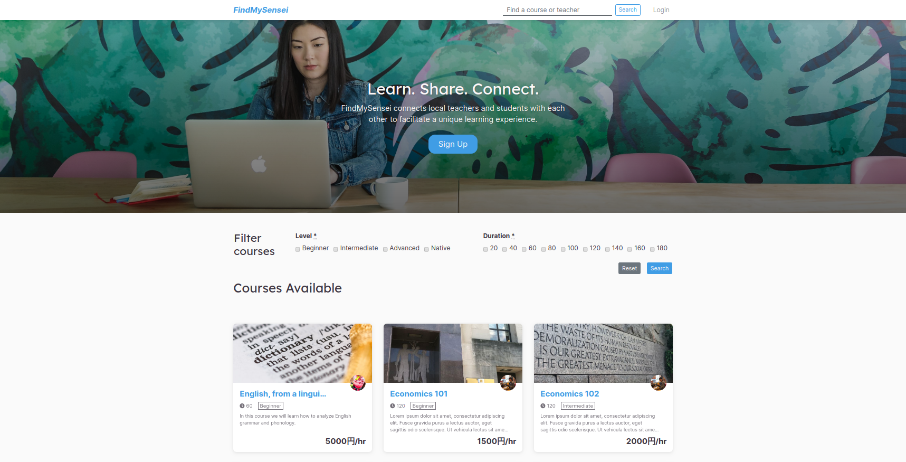
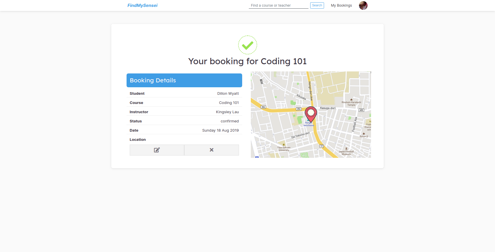
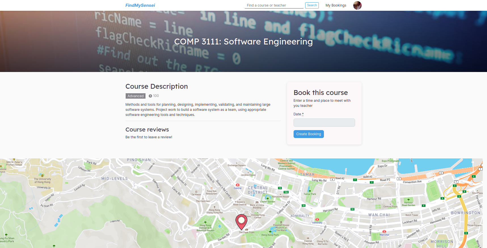

A marketplace app designed to connect students with teachers in the local area.
> ###Learn, Share, Connect

For this project I worked with a small team of developers over a period of five days to develop this app using Ruby on Rails. I was in charge of designing and developing the app's front-end.

FindMySensei is a platform for students and teachers; for students, they can find reputable tutors on a variety of subjects in their area, backed by user reviews. Teachers offer affordable prices for the classes and can use the platform to earn supplementary income using their expert knowledge of a particular field.

Users can create bookings for classes and decide on a location together; the app offers the ability to accept or reject a booking to ensure quality of lessons and users. Furthermore, the courses can be serached through from the navigation bar or filtered from the home page to make it easier to browse and find what exactly you're looking for.

