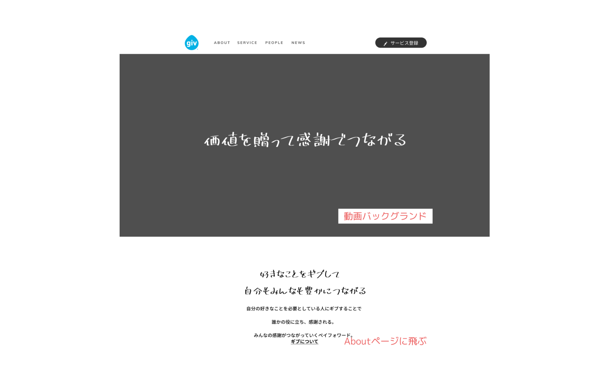
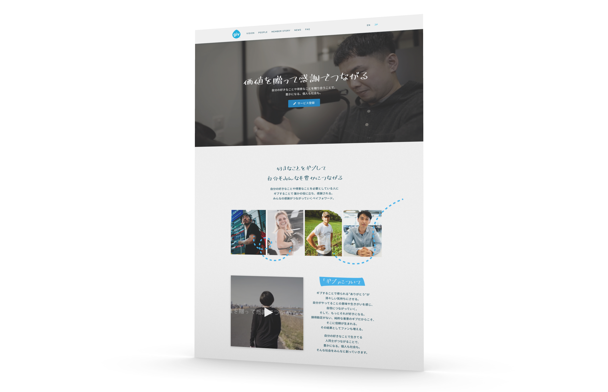
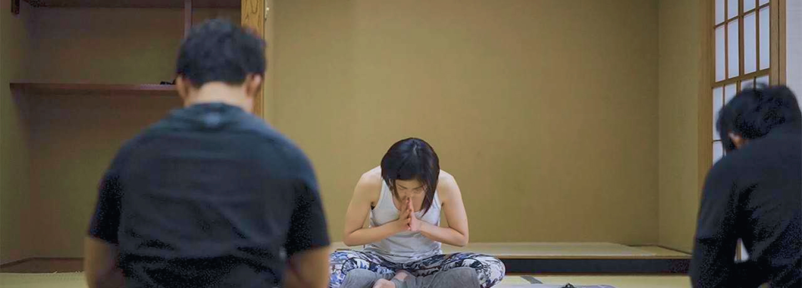

###### *I was approached by the client to redesign the Giv product website and implement the design for a cleaner, refreshing look to better resonate with the user base.*

### Project outline

_Giv_ is a matching application that aims to facilitate and promote a service-based commerce system that relies on gratitude and the goodwill of others rather than anything of monetary value. Using the _Giv_ platform, users can sign up and talk to other members to organise an exchange of services (or goods). 

Currently growing a user base in Japan exclusively, a professional stylist could use the platform to exchange their trade - hairdressing - in return for a locally-grown bag of rice and other fresh produce from someone who's a farmer by trade, as one of the many example scenarios made possible by the service.

<iframe width="560" height="315" src="https://www.youtube.com/embed/CNx6CsvxJ3I" frameborder="0" allow="accelerometer; autoplay; encrypted-media; gyroscope; picture-in-picture" allowfullscreen></iframe>

Having not previously worked with a designer, the existing website lacked a clear visual direction; I developed a complete redesign, factoring in the above supplied video, to create and implement <a href="https://giv.link" target="_blank">a new multi-language website</a>.

### Design process

I started by taking into consideration the supplied video and the product vision for inspiration. One of the key ideas behind the product is 感謝 (gratitude); after a successful exchange, members send to each other a _Thanks Card_, where they express their gratitude for the other party's giving.

From this concept of a personalised handwritten message, I developed the product image and basis for the website, using a script typeface to communicate the sense of the individual. Starting with simple wireframes, I moved onto a high-fidelity mockup upon receiving approval from the client.

<small>Website wireframe - home page</small>

<small>Website mockup - home page</small>

### Development process

As a solo project, I had more freedom to refine and tweak the design while figuring out the best way to go about coding the website. The project required a multi-page site with localisation, custom images, videos, and fonts, and blog-style case studies.

I decided to use <a href="https://middlemanapp.com/" target="_blank">Middleman</a>, a Ruby static website builder, paired with <a href="https://tailwindcss.com/" target="_blank">Tailwind CSS</a>; this allowed me to set up localisation, various text styles and keep spacing and alignment consistent throughout complete with a well-organised build process. The use of Tailwind also allowed for a mobile-first approach to ensure that the design is beautiful on displays of any size.

<h4> You can view <a href="https://giv.link" target="_blank">the live website here</a>!</h4>

