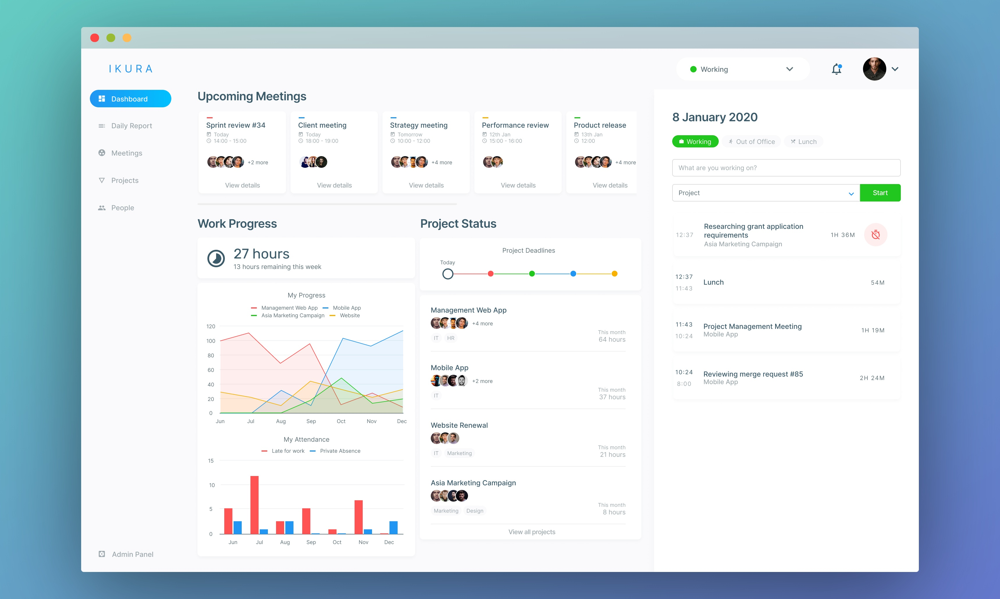
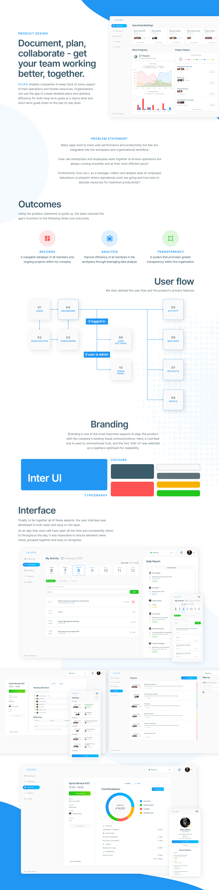

B2B web-based application built for small-to-medium enterprise employee and cost management
> ###Get your team working better, together.

As a member of [DG Takano](https://www.dgtakano.co.jp/), I worked as the lead UI/UX designer on the development team, creating the app layout and architecture as well as implementing designs using HTML, CSS, and JavaScript. This particular project involved developing a web app using Ruby on Rails.

Joining the team after initial development had already begun, I undertook a complete user experience audit to analyse and dissect the primary target audience and purposes for using the app. Using this knowledge, I planned, designed, and executed a complete redesign of the app to better satisfy user needs.

> *Ikura* enables companies to keep track of every aspect of their operations and human resources. Organisations can use the app to create detailed plans and optimise efficiency for both long-term goals at a macro level and short-term goals down to the day-to-day level.

After having defined core user journeys and main features, I narrowed down the product's value proposition to the following three outcomes to be satisfied:

- Provide a navigable database of all members, activities and ongoing projects in my company
- Perform analysis to improve efficiency of all members in my workplace
- Achieve greater transparency in my organisation

From this point, I moved on to developing the interface and rethinking the information architecture of the app. Building out from low fidelity wireframes and eventually onto a full app prototype in Figma, I consulted with the development team along the way and redesigned each page for a better usability experience.

For example, on the user dashboard, I worked to group similar items together and provide to the user a quick overview of all the day's activities and events. Meetings, being the most pertinent and time sensitive information on a daily basis, was given highest priority in the visual hierarchy. Then, using previously collected usage data from the app's first version (a proof of concept used in-house), I identified a need for users to easily add their current task from the dashboard. The pictured right panel, allows users to maintain a consistent and accurate record of daily productivity without having to navigate away from the dashboard page.

