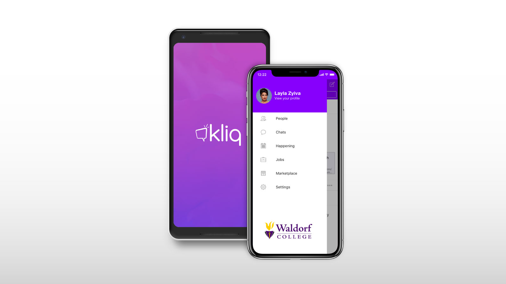
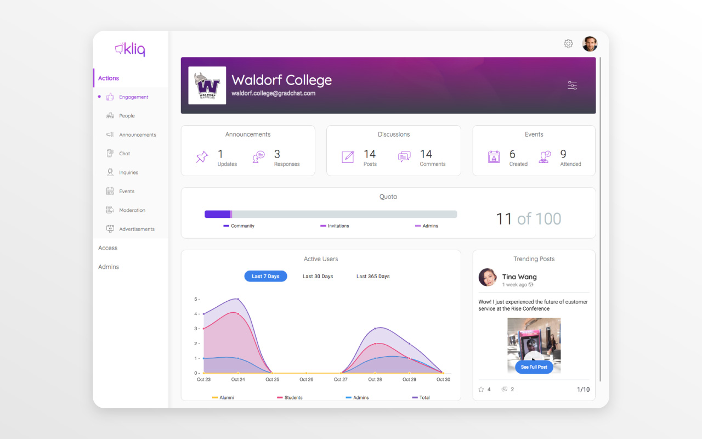
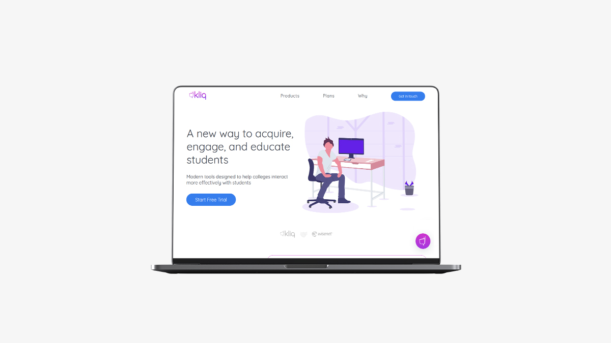
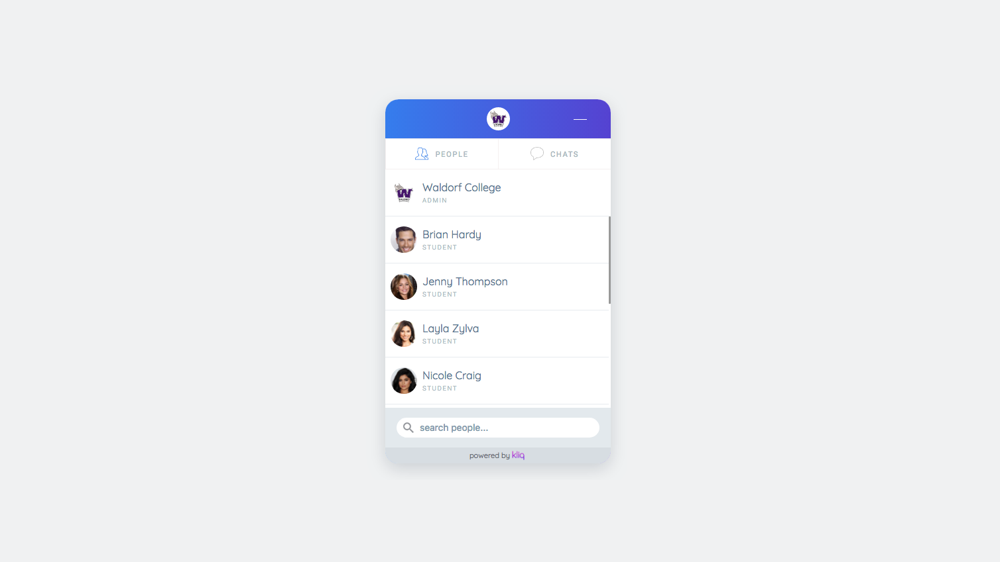

A messaging and networking solution developed for member-based organisations and education providers in Australia.

The brief required the creation of the brand identity complete with logo, brand guide, marketing collateral and a website. Targeting those in the vocational education industries, the software aims to capitalise on the underutilised area of mobile and web technology to promote community and engagement while allowing institutions to more effectively communicate to both current and prospective students.

The focus in this visual communication was to convey the brand as a refreshing, modern, and affordable solution with the ability to revolutionise the way in which the target audience views messaging. The brand logo consists of a clean, rounded typeface and a chatbox as the brandmark. The defining feature of the brand is the cool purple gradient hue, which seeks to separate it from the competition in the education software industry.

