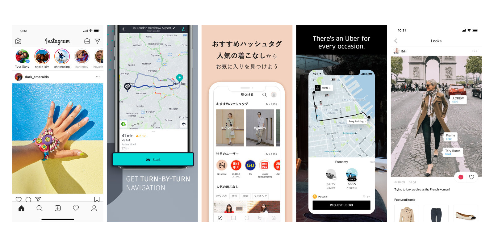
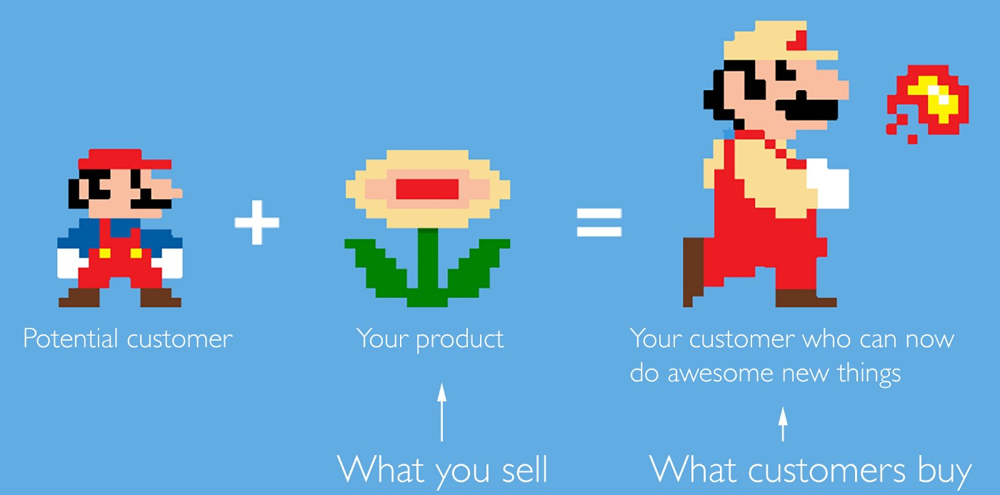
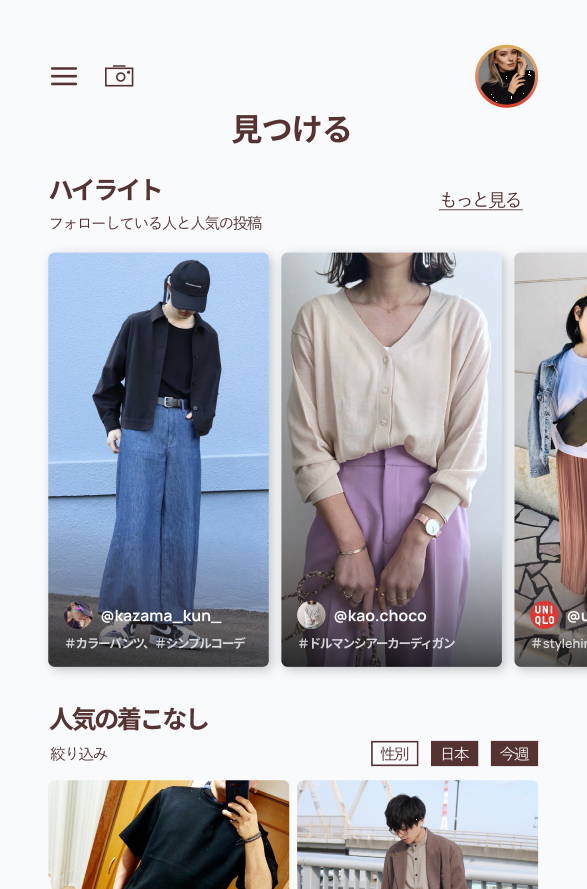
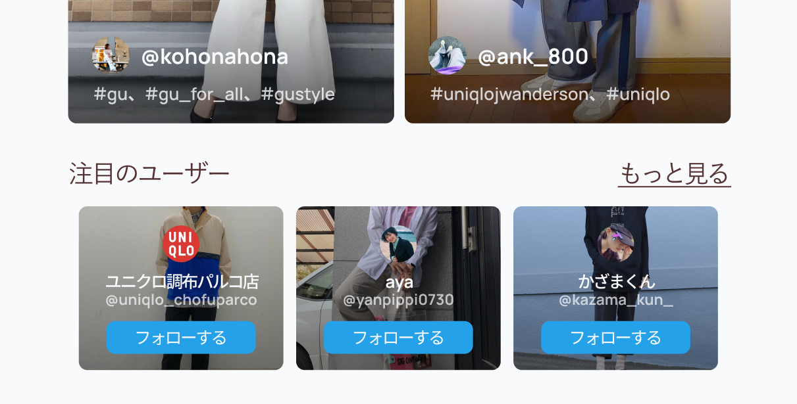

###### *The following is a design exercise with the aim of improving upon an existing product to better reach the target market. It covers research, analysis and design of a basic mockup to validate findings.*

### The product

> StyleHint is an app that helps you discover trends from around the world. 
You can search for #westcoast, #usa, #uniqloxjwa, #uniqlo, #stylehintpartner, and more
UNIQLO and GU store staff post their outfits everyday, so check out the latest looks and perennial styles you love.

### Outline

Given the app, <a href="https://apps.apple.com/us/app/stylehint/id1440248752?mt=8" target="_blank">StyleHint</a>, I decided to approach the process of improving the UI design through the following steps:

- **Understand**: Conduct some basic competitive research; identify and analyse what are useful features or approaches
- **Define**: Construct statements to empathise and summarise what users primarily want out of this product
- **Ideate**: Brainstorm and generate designs to improve upon the original

### Understand

To gain inspiration and a general understanding of the target market, I looked at the app and some products with similar core users. In particular, I sought to understand what are the primary features that keep users coming back, ultimately turning usage into learned habits, and how are these elements positioned in the layout.

What I found is that for apps like *Instagram*, a strong competitor to StyleHint, and even with apps such as *Uber* or *Here Maps*, content is king. There's an overarching purpose for the product - I think navigation apps communicate this concept well. Users go to this app because they want to be told "This is how you get from point A to B". Upon opening the interface for the first time, you get the map, your location, and a search bar - the usage is clear and needs no explanation. There are other useful features if you navigate to the menu, but the main concern is answered from the outset.

Similarly, *Instagram* tells users "This is what is going on within your community", the user's feed is at the forefront but also allows for discovery of content that is just outside of what he or she may be used to. This kind of variable reward is an important idea that keeps the user experience engaging and something I think is worth noting. Using this research and analysis, I progressed to defining the problems faced by the core market and possible solutions.

### Define

For the exercise, I decided to use a <a href="https://jtbd.info/2-what-is-jobs-to-be-done-jtbd-796b82081cca" target="_blank">Jobs to be Done</a> approach to analysing and improving this app. A Job to be Done (JTBD) can be defined as:

> The process a consumer goes through whenever she aims to change her existing life-situation into a preferred one, but cannot because there are constraints that stop her.

First of all, I defined *the problem* and *the target audience* - who is using the app, what is their mission, their motivator for seeking out this product and what obstacles are there to acheiving this goal. Judging by the current app, the product description, and user reviews, I narrowed down the target audience as follows:

**The typical user would be someone with low-to-medium disposable income; they would be someone who is young, aged between 14 - 36, fashion-conscious and takes great pride in their appearance. The user would most likely have some interest in the UNIQLO/GU brand and would associate themselves with a simple, yet elegant appearance.**

Then, I sought to define what are the major pain points for this type of user and what functions do they desire?

**Picking outfits and keeping up with trends is time-consuming and inefficient. I want to discover new outfit ideas to inspire myself and also expand my collections by easily finding out what any given model is wearing and where to purchase it.**

From this foundation, I built a basic profile of the average user and what is important to them. As I'm looking to improve upon an existing product, I decided to take this further and define a number of Jobs - the type of outcomes that will make the user better. Products are made to sell *something*, but they should also offer an experience, idea, or solution - one that not only satifies an intermediary goal but also the end goal and a core need. As once observed by Harvard Business School Professor Theodore Levitt: “People don’t want to buy a quarter-inch drill. They want a quarter-inch hole".

So what Jobs should this product Do? I defined three outcomes that should be fulfilled and used them as the basis for my analysis. The Jobs to be Done are:

- **Help me to learn more about current trends and colour coordination to relieve the pain point of choosing a satisfying outfit each day.**
- **Give me a sense of connection so that I can start the day off positively and feel like I’m tied to a movement with ‘my people’**
- **Make choosing outfits a quick and easy activity that I look forward to each day so that I can save time and worry about more important things.**

### Ideate

Starting from rough sketches, I moved on to developing a mockup for only the main page of the app as a proof of concept. In my opinion, this is the page that has the most to gain from subtle improvements. There were a few things that I decided to change in the new design in order to simplify the layout - to do this, I referred to the aforementioned JTBD and decided to rework this page with the focus on the outfits and organic discovery.

#### Menu

I swapped out the bottom-fixed navigation with a hamburger menu to reduce elements that detract from the primary goal of "being inspired". In the menu, I combined the search and search by image into a single element, moved the promotional banner, as well as condensing popular hashtags under "Discover".

  <video autoplay loop style="width: 50%; height: auto">
    <source src="home.mp4" type="video/mp4">
  </video>
  <video autoplay loop style="width: 50%; height: auto">
    <source src="menu.mp4" type="video/mp4">
  </video>

#### Highlights

Another aspect I thought to improve was to present to the user more content from their immediate community. As such, I added a "Highlights" section of curated images from top users and people that the user is following. With the assumption that users would be opening this app early in the day to help them choose their outfit, knowing what people they admire or what their friends are wearing any given day adds a sense of personalised connection.

#### Cards

With the cards, I decided to, primarily, make a greater emphasis on the community of the app through attaching usernames and profile photos to each outfit. From a user perspective, together with the attached tags, this allows for greater discoverability and the ability for users to create associations between what they are seeing and who it is coming from. Similarly, the section for "Recommended users" is moved to within the "Popular styles" feed; if User A sees User B pop up on her feed many times and then is specifically given a prompt to "follow User B", User A doesn't have to navigate away from what she is already looking at and the chance of this action succeeding is greatly increased.

### Further considerations

If I were to develop this concept further to also consider restructuring of information architecture and user experience, I would research and consider implementing the following ideas:

- Wardrobe organisation: users may want to use the app to keep their clothing collection clean and organised. Perhaps the app could allow users to upload photos of their clothes and where they've stored it to make items easier to find. Additionally, the app could, with a database full of users' clothes, analyse the colours in their wardrobe and suggest new outfits that match well together.
- Rewards: in order to make the experience more social and encourage user engagement, a points system could be implemented from which users can receive rewards or store discounts according to how active they are in the app.
- Work with external vendors: expand the database to include and identify clothing items from other sellers so that the product can also reach fringe user markets and increase revenue.
