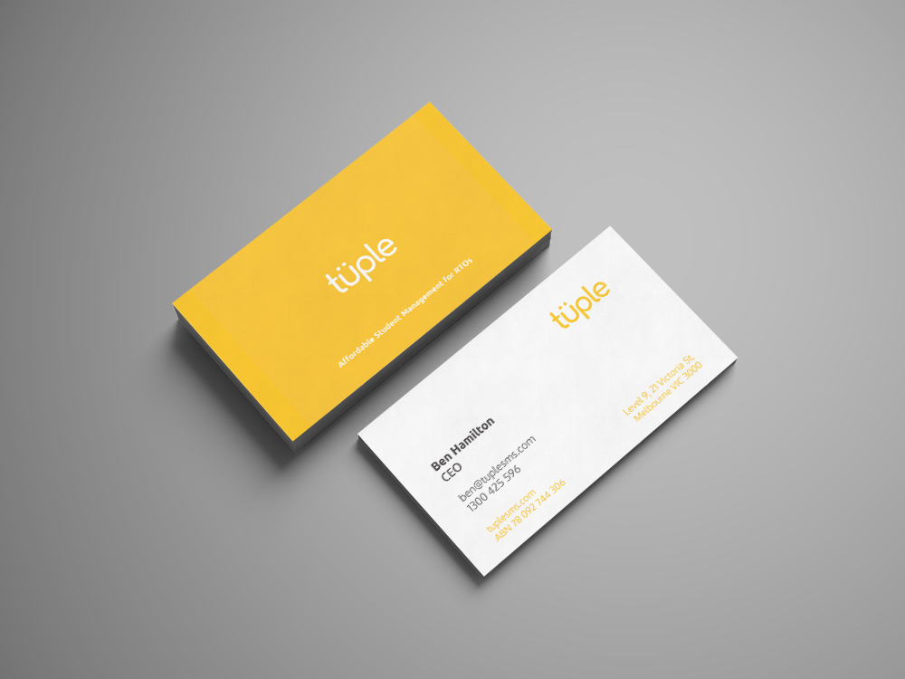
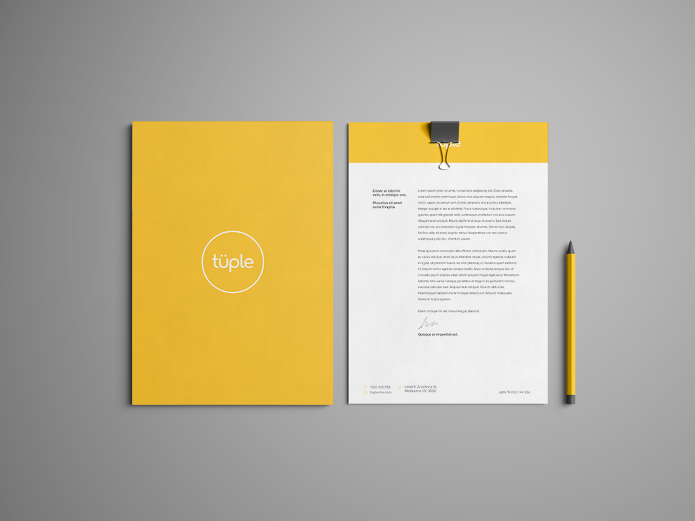
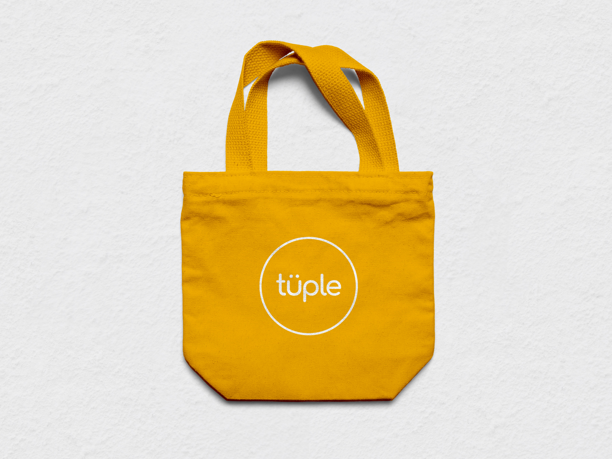
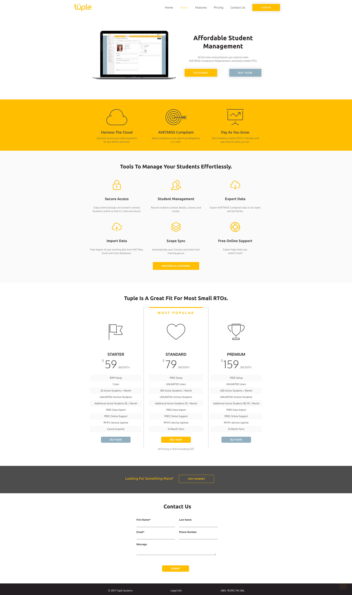

Tuple is a student management software solution developed for training organisations in the vocational education sector in Australia.

The brief required the creation of a completely new brand. Targeting those in the vocational education industries, the software aims to be a cost-effective, ‘no-frills’, student management solution.

The visual communication required the design of a logo, style guide, website built through WordPress, business card, envelope, letterhead, and tote bag.

As a low-cost solution, the focus was on conveying the brand as reliable, trustworthy, and easy-to-use. As such the brand wordmark, consists of rounded edges in a clean, legible typeface. The diacritical marks were added atop the ‘U’ to express a sense of playfulness.

A vibrant, warm yellow colour is the defining element of the brand; in addition, subtle blue hues are used to balance branding elements and communicate the brand’s message to the target audience

