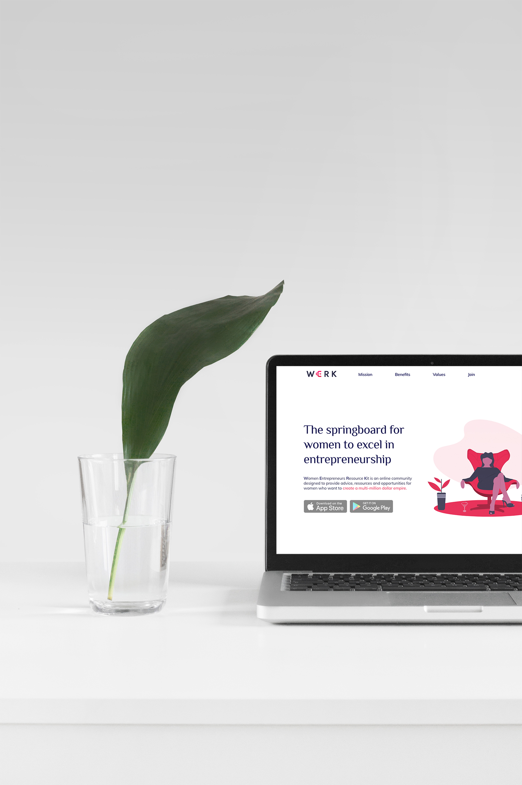
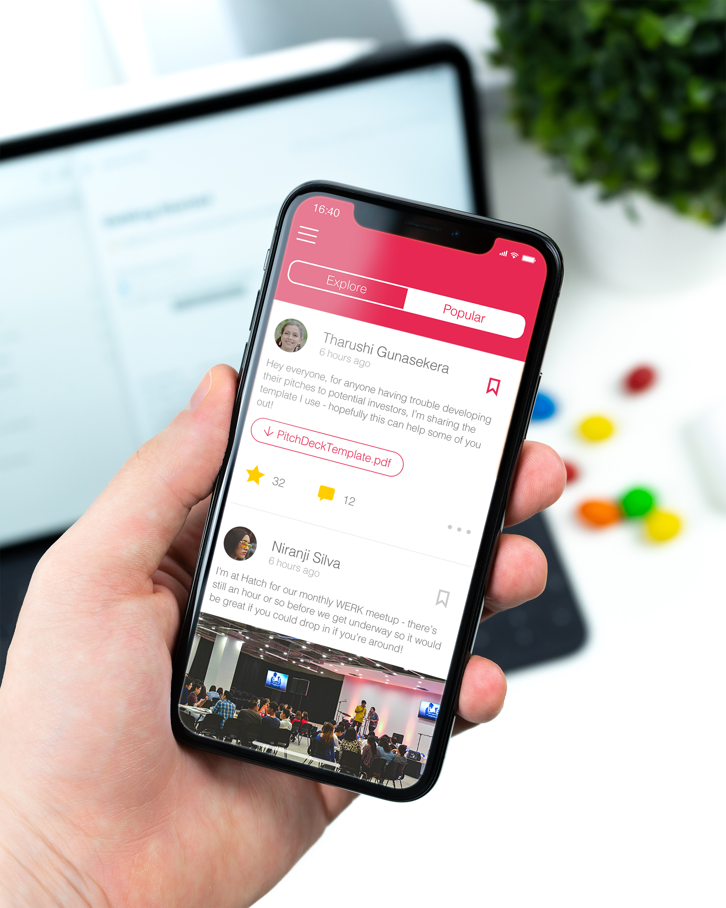
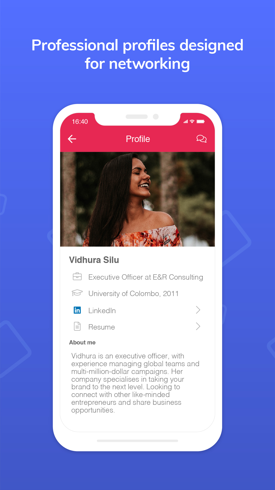

An exclusive member community championing female entrepreneurship in Sri Lanka.
> ###Women Entrepreneurs Resource Kit is an online community designed to provide advice, resources and opportunities for women

Built on the [Kliq](https://www.kliq.app) platform, WERK is a community designed to connect professionals from a variety of fields together as mentors, coworkers, or friends. Users can talk to each other within their network from the newsfeed, organise meetups and events, or find work posted by potential employers. For this project, I designed the brand identity, logo, app mockups, and built the website using WordPress.

