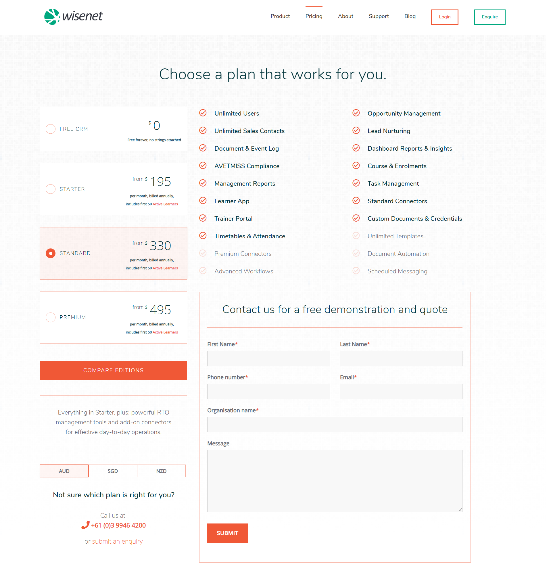
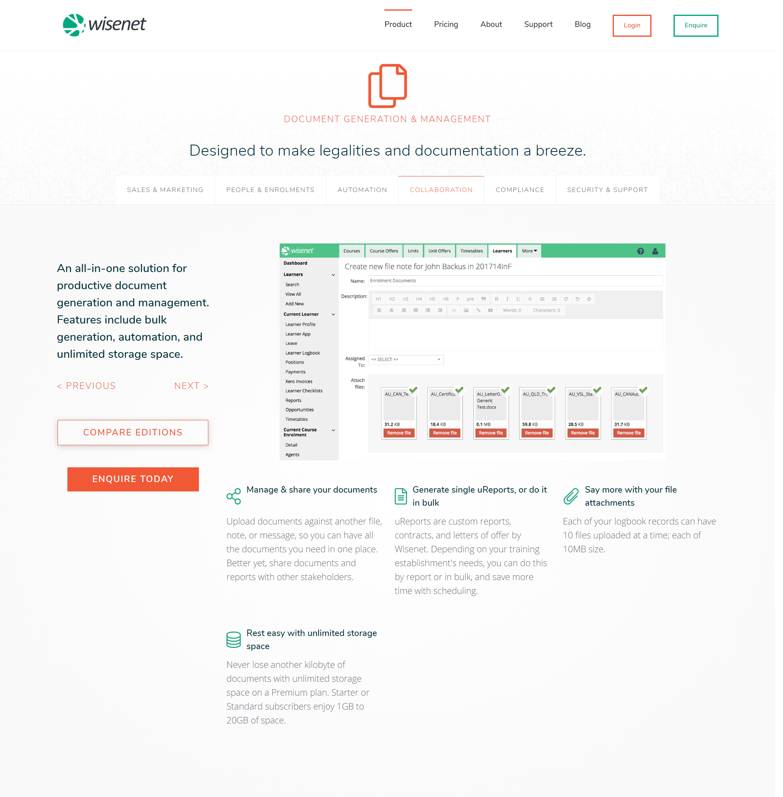
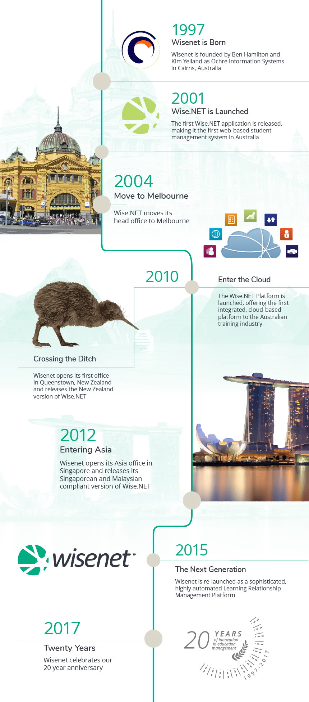
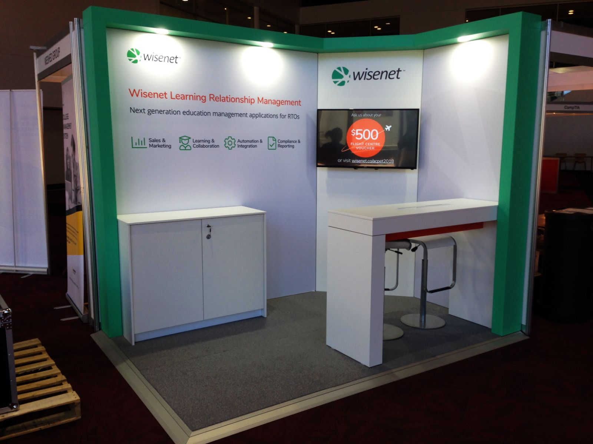

The leading management software for education providers in Australia.
> ###Student success starts with Learning Relationship Management

I worked with Wisenet, a division of [AdaptIT](https://www.adaptit.co.za/homepage), to update and improve their branding across the board. This included the production of print media such as flyers and banners, videos and promotional media, product wireframes and mockups, a revision of their branding style, and most notably, a complete overhaul of their corporate website.

Introducing a new orange colour and new fonts to the identity, the aim was to refresh the brand from what was a fairly clinical and plain aesthetic. In order to better communicate to the target audience, I chose to use this complementary colour scheme and font "Nunito" to add contrast and a sense of dynamism.

The corporate site redesign, built on Hubspot CMS, proved to be the biggest challenge; consideration of efficient information architecture was the primary concern. With a wealth of information to display and features to introduce, we chose to break down the site into multiple sections. On the home page, the design is simplified to provide a broad overview of the company, support, and the product. Users can then navigate to other more detailed pages through the links or navigation bar. Likewise, on the pricing page, the primary view is condensed to a single-page view. Using Javascript and jQuery, different plans and product information is displayed depending on the user's selections. As before, the full product feature matrix can also be viewed by scrolling further down the page.

