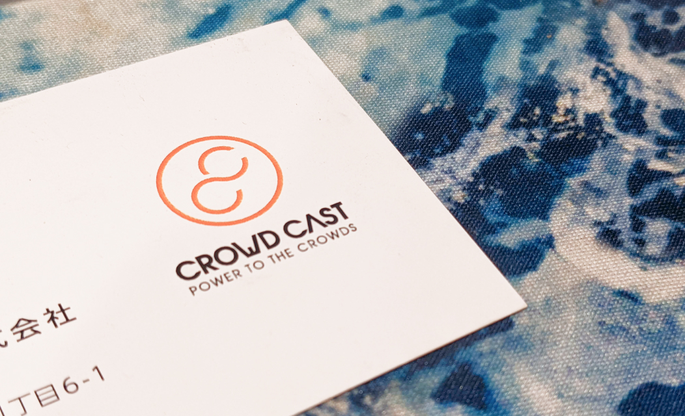

<figure className={props.responsive}>

</figure>

<section className={`${props.info} ${props.columns}`}>

<ProjectInfo tags={props.frontmatter.tags} date={props.frontmatter.date} link={props.frontmatter.link} />

### Building off the existing brand, I renewed the logo and website to breathe a breath of fresh air into the brand image.

_As a member of Crowd Cast, I was tasked with renewing the website and image of the corporate brand. Here, I’ve documented my personal thoughts and design process - this does not in any way represent the company._

</section>

**The project**

### Crowd Cast develops financial solutions for small-to-medium enterprises and aims to bring their internal accounting infrastructure paperless and up-to-date with the modern age in Japan.

<caption className="caption m-5">
    
For reference, the old website and logo

</caption>

**Updating the visuals**

### Instead of undertaking a complete redesign, I used the original artwork as a base, rebuilding the logo on a geometric grid for better consistency and legibility in a wide variety of contexts

<figure className={props.responsive}>

</figure>

**Refreshing the website**

### I sought to create a more professional and personable brand image for the corporate website to better communicate the story and culture of the company.

