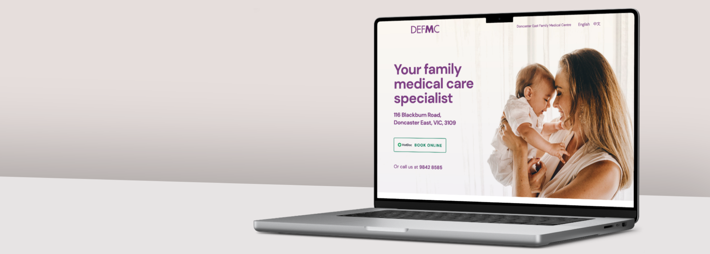
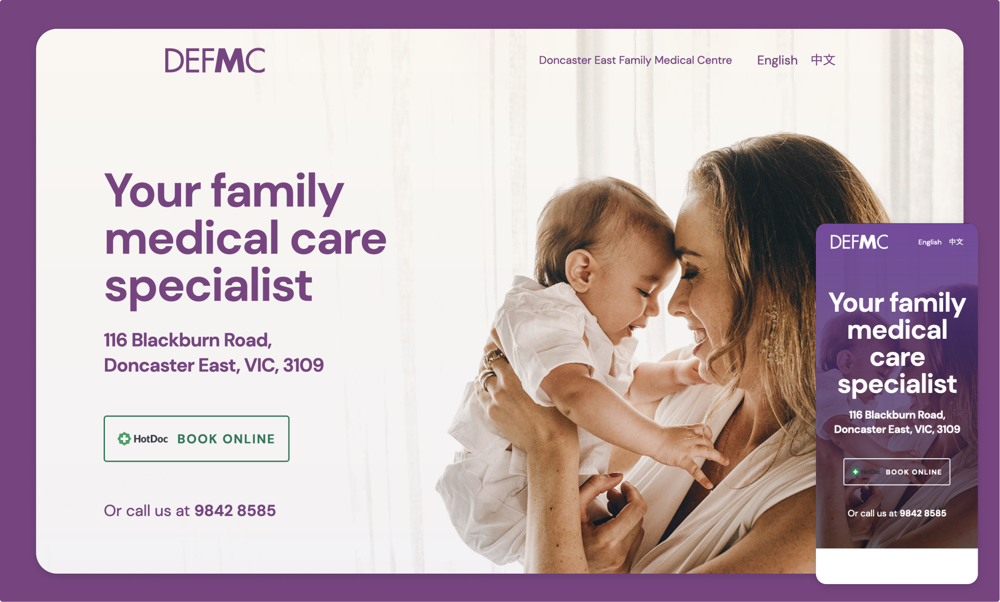
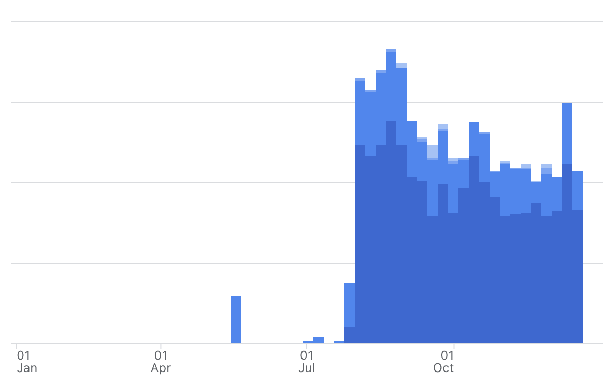
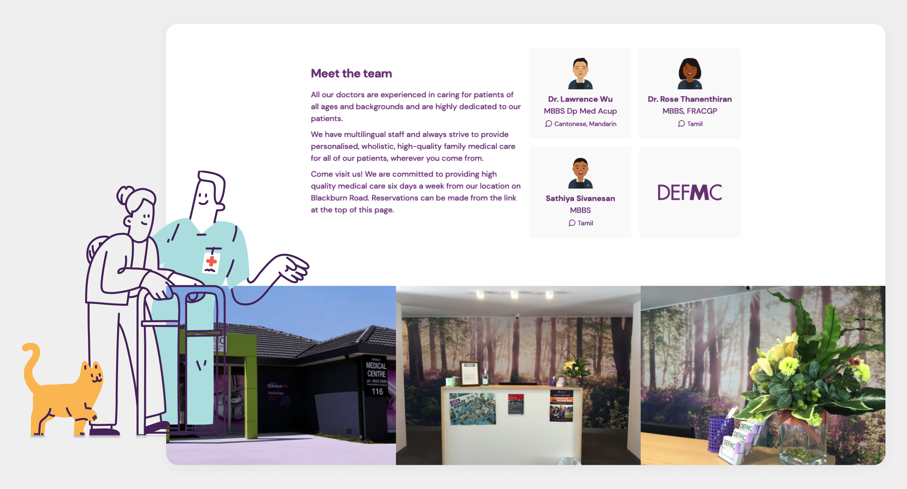

<figure className={props.responsive}>

</figure>

<section className={`${props.info} ${props.columns}`}>

<ProjectInfo tags={props.frontmatter.tags} date={props.frontmatter.date} link={props.frontmatter.link} />

### I redesigned and developed a new website for a Family Doctor in Australia to better communicate critical information.

In the wake of the COVID-19 pandemic, the client found it imperative to ensure that visitors to the clinic were aware of testing procedures and had the most up-to-date information available.

</section>

<figure className="m-5">

</figure>

### In addition to refreshing the design, I rebuilt the site from the ground up - implementing support for news posts/blog, both English and Chinese text and SEO optimisation. This led to a substantial increase in user traffic and organic search hits from the previous site.

<figure>

</figure>

<figcaption className="caption">
    
<a href={props.frontmatter.link} target="_blank" rel="noopen noreferrer">
Check out the live website here
</a>

</figcaption>
