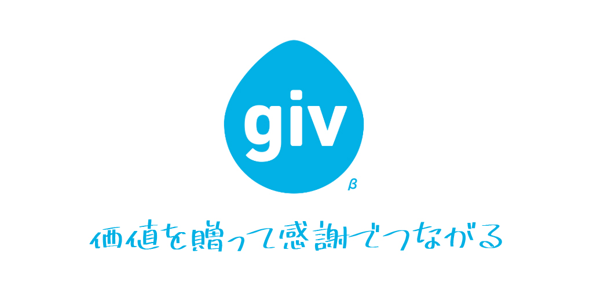
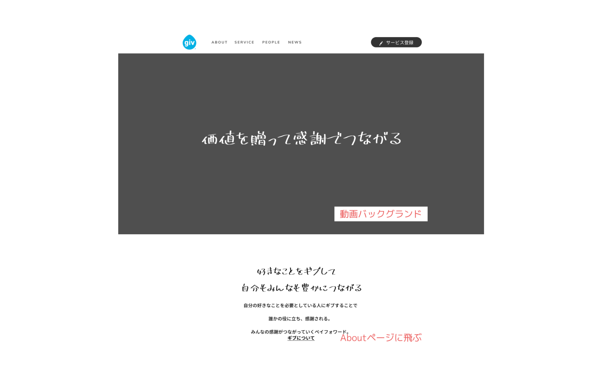
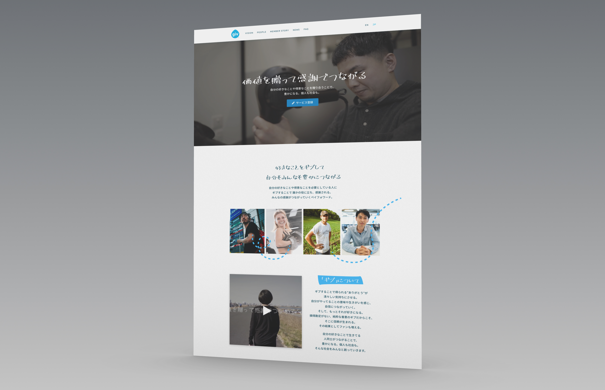

<figure className={props.responsive}>

</figure>

<section className={`${props.info} ${props.columns}`}>

<ProjectInfo tags={props.frontmatter.tags} date={props.frontmatter.date} link={props.frontmatter.link} />

### I was approached by the client to redesign the Giv product website and implement the design for a cleaner, refreshing look to better resonate with the growing user base.

_Giv_ is a matching application that aims to facilitate and promote a service-based commerce system that relies on gratitude and the goodwill of others rather than anything of monetary value. Using the _Giv_ platform, users can sign up and talk to other members to organise an exchange of services (or goods).

Currently growing a user base in Japan exclusively, a professional stylist could use the platform to exchange their trade - hairdressing - in return for a locally-grown bag of rice and other fresh produce from someone who's a farmer by trade, as one of the many example scenarios made possible by the service.

</section>

<figure className={`${props.responsive} m-5`}>

</figure>

**The project**

<iframe
  width="560"
  height="315"
  src="https://www.youtube.com/embed/CNx6CsvxJ3I"
  frameborder="0"
  allow="accelerometer; autoplay; encrypted-media; gyroscope; picture-in-picture"
  allowfullscreen
></iframe>

### I developed a complete redesign, using the above supplied video as inspiration, to create and implement <a href="https://giv.link" target="_blank" rel="noreferrer noopen">a new multi-language website</a>.

**Design process**

### I developed the product image and basis for the website, using a script typeface to communicate the sense of the individual.

One of the key ideas behind the product is 感謝 (gratitude); after a successful exchange, members send to each other a _Thanks Card_, where they express their gratitude for the other party's giving.

<figure className={`${props.responsive} m-5`}>

</figure>

**Development process**

### The completed project is a multi-page site with localisation, custom images, videos, fonts, and blog-style user profiles.

You can view <a href="https://giv.link" target="_blank" rel="noreferrer noopen"> the live website here!</a>

