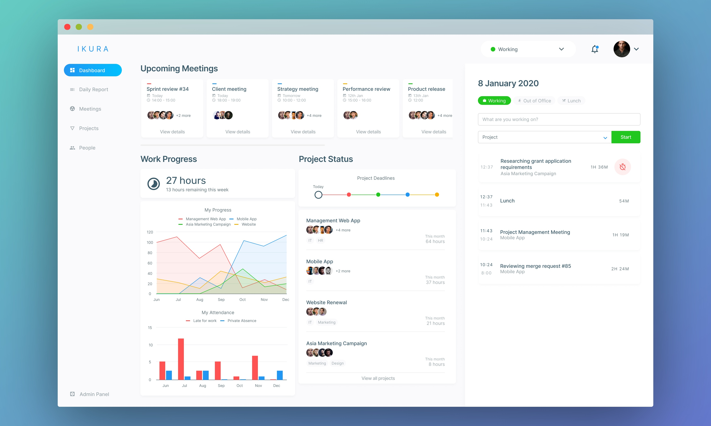
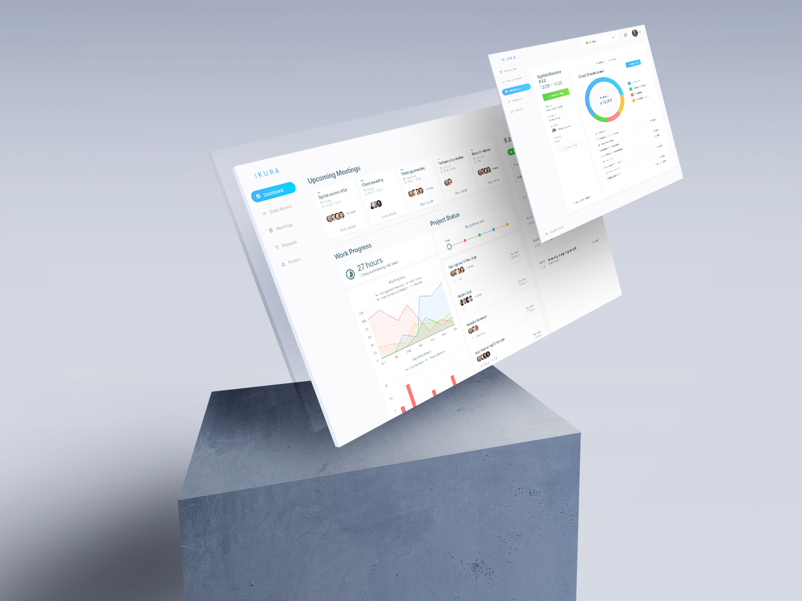
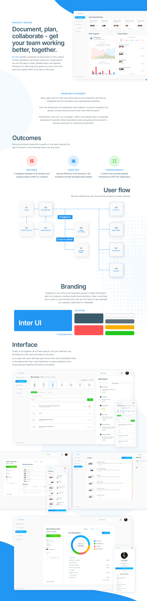

<figure className={props.responsive}>

</figure>

<section className={`${props.info} ${props.columns}`}>

<ProjectInfo tags={props.frontmatter.tags} date={props.frontmatter.date} link={props.frontmatter.link} />

### A B2B web-based application built for small-to-medium enterprise employee and cost management.

_The following documentation covers the design process that went into developing a MVP Ruby on Rails web app over the course of a few months._

</section>

## Get your team working better, together.

### I undertook a complete user experience audit to analyse and dissect the primary target audience and purposes for using the app. Using this knowledge, I planned, designed, and executed a complete redesign of the app to better satisfy user needs.

<figure className={`${props.responsive} m-5`}>

</figure>

### After having defined core user journeys and main features, I narrowed down the product's value proposition to the following three outcomes to be satisfied:

- Provide a navigable database of all members, activities and ongoing projects in my company
- Perform analysis to improve efficiency of all members in my workplace
- Achieve greater transparency in my organisation

