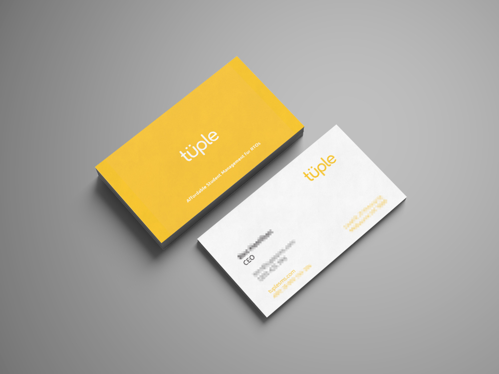
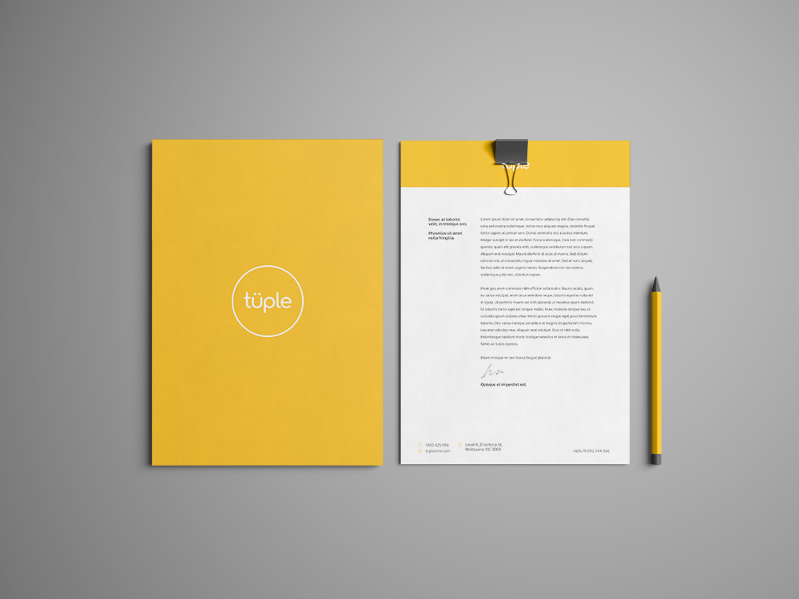
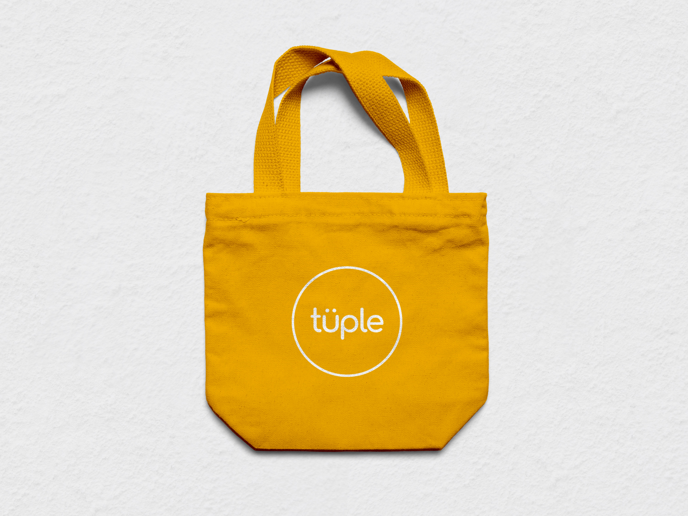

<figure className={props.responsive}>

</figure>

<section className={`${props.info} ${props.columns}`}>

<ProjectInfo tags={props.frontmatter.tags} date={props.frontmatter.date} link={props.frontmatter.link} />

### A student management software solution developed for training organisations in the vocational education sector in Australia.

Targeting those in the vocational education industries, the software aims to be a cost-effective, ‘no-frills’, student management solution.

I created the logo and brand identity for this product.

</section>

### As a low-cost solution, the focus was on conveying the brand as reliable, trustworthy, and easy-to-use.

### A vibrant, warm yellow colour is the defining element of the brand and communicates a childlike playfulness.

